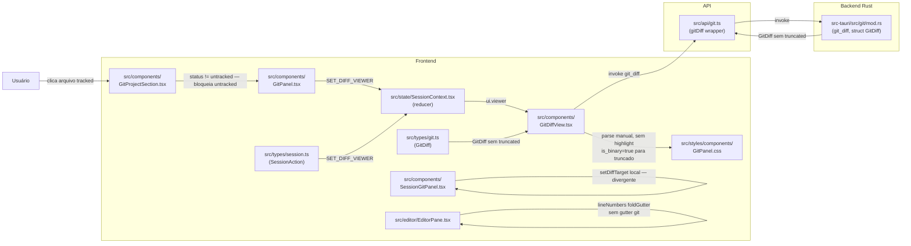
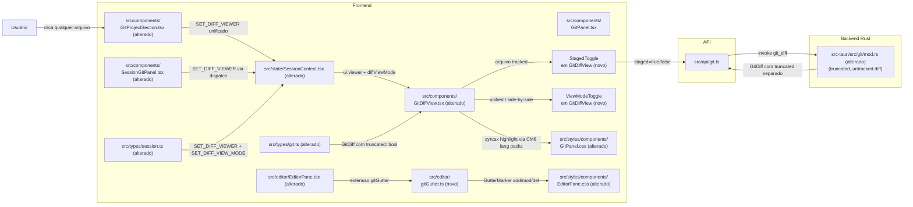

# Implementation Plan

## Request Summary

- **Objective**: Corrigir o painel Git do Entry IDE para que cliques em qualquer arquivo (incluindo untracked) abram a visualização de diff/conteúdo; unificar o comportamento entre `GitPanel` e `SessionGitPanel`; enriquecer o viewer com toggle staged/unstaged, syntax highlight, side-by-side e word-level diff; adicionar gutter de mudanças no editor CodeMirror 6.
- **Scope in**: Rust `git_diff` (untracked + campo `truncated`), `GitProjectSection` (desbloqueio de clique), `SessionGitPanel` (remoção de `diffTarget` local), `GitDiffView` (viewer rico), `EditorPane` (extensão de gutter), CSS em `src/styles/components/GitPanel.css` e `src/styles/components/EditorPane.css`, tipos em `src/types/git.ts`, action em `src/types/session.ts`.
- **Scope out**: `GitConflictViewer`, `GitLogView`, `GitStashSection`, `GitBranchSelector`, diff inline tipo GitHub PR, blame/histórico de linha, diff para binários reais, quaisquer mudanças em Explorer ou PTY.
- **Tier**: standard
- **Architecture references**:
  - `CLAUDE.md` — TypeScript strict, CSS por componente em `src/styles/components/`, sem CSS-in-JS, estado em `SessionContext`.
  - `ARCHITECTURE.md` — estado global via `useReducer` em `SessionContext`; API Layer em `src/api/` como wrapper tipado sobre `invoke()`; CodeMirror 6 já em uso com `gutter`, `lineNumbers`, `foldGutter` em `EditorPane.tsx`.
  - `DESIGN_PRINCIPLES.md` — Princípio 2 (Fast by default): novas dependências precisam justificar peso; RNF-02 fixa syntax highlight via language packs já presentes (delta bundle ~0).
  - AGENTS.md ausente no repositório — plano cita `ARCHITECTURE.md`, `CLAUDE.md` e `DESIGN_PRINCIPLES.md` como fontes de restrição arquitetural.
- **Structural constraints**: `.sensei/rules.toml` presente (`max_lines_per_file = 500`, `max_cc = 20`). Arquivos que crescerem acima de 500 linhas devem ser decompostos (aplicável a `GitDiffView.tsx` e `GitPanel.css` que já hospedam os estilos de diff).

---

## Context Filter

Filtro resolvido: sem `context_filter` explícito — todos os arquivos listados em "Distribution by Repo" foram lidos.

---

## AS IS — Componentes impactados



`GitProjectSection` bloqueia cliques em arquivos `untracked` (linha 224). `SessionGitPanel` mantém `diffTarget` local em vez de despachar `SET_DIFF_VIEWER`, criando comportamento divergente. O backend não gera diff para untracked e colapsa truncamento em `is_binary=true`. `GitDiffView` não tem syntax highlight, toggle staged/unstaged, nem layout side-by-side. `EditorPane` não possui extensão de gutter para marcadores de mudanças git.

---

## TO BE — Componentes propostos



Após a implementação: qualquer arquivo abre diff via `SET_DIFF_VIEWER` unificado (T01, T02, T03); `GitDiff` carrega campo `truncated` separado de `is_binary` (T01); untracked exibe conteúdo completo como adição (T01); o viewer oferece toggles staged/unstaged e unified/side-by-side com syntax highlight (T04, T05, T06); o editor exibe gutter de mudanças por linha (T07). Novos nós: `gitGutter.ts` (T07), `StagedToggle` e `ViewModeToggle` inlineados em `GitDiffView` (T05, T06), ação `SET_DIFF_VIEW_MODE` no reducer (T06).

---

## Tasks

### T01 — Rust: adicionar `truncated` em `GitDiff` e gerar diff para arquivos untracked

- **Arquivos**:
  - `src-tauri/src/git/mod.rs` (struct `GitDiff`, função `git_diff`)
  - `src/types/git.ts` (interface `GitDiff`)
- **Change**:
  1. Adicionar campo `pub truncated: bool` em `struct GitDiff` (linha 144-151). Atualizar todos os pontos de construção de `GitDiff` no arquivo para incluir `truncated`.
  2. No bloco do truncamento (linha 1039-1042): setar `truncated = true` e **não** setar `is_binary = true`. Remover a linha `is_binary = true` do branch de truncamento; manter `diff_text` descritivo somente para uso de UI (ou limpar — o frontend usará `truncated` para exibir a mensagem).
  3. Para arquivos `untracked`: antes do bloco `if staged { ... } else { ... }` (linha 998), adicionar um branch que detecte se o arquivo não está no índice (verificar via `repo.index()?.get_path()` ausente) e, nesse caso, leia o conteúdo do arquivo com `std::fs::read()`, detecte binário por bytes nulos, e monte um `diff_text` com todas as linhas prefixadas por `+` (formato unified sem cabeçalho de hunk — compatível com o parser existente em `GitDiffView`). Preencher `additions = linha_count`, `deletions = 0`, `is_binary = false` (para texto), `truncated = false` (se dentro de `MAX_DIFF_BYTES`).
  4. Em `src/types/git.ts`: adicionar `truncated: boolean` em `GitDiff` (após `is_binary`). TypeScript strict mode fará falha de compilação em qualquer consumidor que não trate o campo — validação automática por CT-01.
- **Covers**: RF-03, RF-05, RF-09, CT-01, CT-02
- **Tests**: `src/__tests__/git-context-bugs.test.ts` — adicionar casos: (a) `GitDiff.is_binary` permanece `false` para arquivo texto truncado; (b) `GitDiff.truncated` é `true` para arquivo truncado; (c) `GitDiff.diff_text` contém linhas `+` para arquivo untracked texto. Seguir o padrão existente do arquivo (mocks de `invoke` via `vi.fn()`).
- **Risk**: Medium — a lógica de detecção de untracked via `repo.index()` pode falhar em edge cases (arquivo renomeado, submodule). Mitigação: cobrir com testes unitários; retornar `Err(...)` descritivo em vez de panic.
- **Dependencies**: none

---

### T02 — Frontend: desbloquear clique em arquivos untracked em `GitProjectSection`

- **Arquivos**:
  - `src/components/GitProjectSection.tsx` (linha 223-227)
- **Change**: Remover a guarda `if (file.status !== "untracked")` em `handleFileClick`. Passar todos os arquivos para `onDiffFile` sem filtragem por status. O backend agora retorna diff válido para untracked (T01 — dependência obrigatória antes de testar este ponto de ponta a ponta).
- **Covers**: RF-01
- **Tests**: `src/__tests__/git-context-bugs.test.ts` — adicionar caso: `handleFileClick` chamado com `file.status = "untracked"` deve invocar `onDiffFile` (spy). Verificar que o callback não é suprimido.
- **Risk**: Low — mudança cirúrgica de uma linha. Blast radius: somente o handler de clique; o resto de `GitProjectSection` não é afetado.
- **Dependencies**: T01 (backend deve retornar diff válido para untracked antes do teste E2E)

---

### T03 — Frontend: unificar `SessionGitPanel` para usar `SET_DIFF_VIEWER`

- **Arquivos**:
  - `src/components/SessionGitPanel.tsx`
  - `src/types/session.ts` (verificar se `SET_DIFF_VIEWER` cobre o caso — já presente na linha 354, sem alteração de tipo necessária)
- **Change**:
  1. Remover o estado local `diffTarget` (linha 28) e o `useEffect` que o limpa (linha 51-53).
  2. Remover o handler `handleDiffFile` que chama `setDiffTarget` (linha 66-68).
  3. Substituir por um handler que chame `dispatch({ type: "SET_DIFF_VIEWER", sessionId: sid, projectId: rid, file })` — importar `useSessionContext` / `dispatch` do `SessionContext` (padrão já usado em outros componentes do projeto).
  4. Remover a renderização de `<GitDiffView variant="modal">` que dependia de `diffTarget` (linha 128-134). O diff agora renderiza via `App.tsx:966` (side viewer global), já funcional para `GitPanel`.
- **Covers**: RF-02
- **Tests**: `src/__tests__/session-context-bugs.test.ts` ou novo `src/__tests__/git-diff-unification.test.ts` — verificar que após clicar em um arquivo via `SessionGitPanel`, `ui.viewer` no estado do reducer reflete o arquivo selecionado (snapshot do estado do reducer).
- **Risk**: Low — remoção de estado local redundante. Blast radius: `SessionGitPanel` somente; o side viewer já funciona via `SET_DIFF_VIEWER` em `GitPanel`.
- **Dependencies**: none (paralelo a T01/T02)

---

### T04 — Frontend: campo `truncated` no viewer — mensagem diferenciada e aviso UI

- **Arquivos**:
  - `src/components/GitDiffView.tsx`
  - `src/styles/components/GitPanel.css`
- **Change**:
  1. No bloco de renderização (linha 60-78), adicionar condição: `if (diff.truncated)` exibir um banner `<div className="git-diff-truncated-banner">` no header ou rodapé com texto "Diff parcialmente exibido — use o terminal para ver o diff completo". O banner é exibido **além** do diff parcial (não substituindo), ou no topo se `diff_text` estiver vazio.
  2. Remover a condição `if (diff.is_binary)` que exibia "Binary file" para arquivos truncados — agora `is_binary` reflete exclusivamente binários reais (garantido por T01). Manter o bloco "Binary file" para `diff.is_binary && !diff.truncated`.
  3. Em `GitPanel.css`: adicionar estilo `.git-diff-truncated-banner { ... }` com cor de aviso (usar `var(--yellow)`) e padding consistente com o header existente.
- **Covers**: RF-05, RF-09, UI-04
- **Tests**: `src/__tests__/git-context-bugs.test.ts` — adicionar caso BUG-novo: dado `GitDiff { is_binary: false, truncated: true }`, o viewer renderiza o banner de truncamento e não renderiza "Binary file".
- **Risk**: Low — adição de branch condicional no render; sem mudança de lógica existente para casos não truncados.
- **Dependencies**: T01 (campo `truncated` precisa existir no tipo)

---

### T05 — Frontend: toggle staged/unstaged no viewer

- **Arquivos**:
  - `src/components/GitDiffView.tsx`
  - `src/types/session.ts` (adicionar `SET_DIFF_VIEW_STAGED: { staged: boolean }` se o estado do toggle for gerenciado globalmente, ou manter local — ver nota abaixo)
  - `src/styles/components/GitPanel.css`
- **Change**:
  1. Adicionar estado local `const [showStaged, setShowStaged] = useState(file.area === "staged")` em `GitDiffView`. Estado local é aceitável aqui pois o toggle é uma preferência de visualização intra-viewer, não de sessão — sem impacto em outros componentes.
  2. Adicionar lógica: se o `file` passado tiver `area === "staged"`, exibir o toggle; se a `GitSessionStatus` da sessão indicar que o arquivo tem mudanças **apenas** em uma área, ocultar o toggle (UI-01). Para verificar se ambas as áreas têm mudanças, `GitDiffView` precisa receber a lista de arquivos do projeto como prop adicional `projectFiles?: GitFile[]` ou o pai (`App.tsx`) pode derivar `hasBothAreas` e passar como prop booleana — preferir a segunda opção para não acrescentar dependência pesada na API do componente.
  3. No `useEffect` que chama `gitDiff`, usar `showStaged` em vez de `file.area === "staged"` para determinar o argumento `staged`.
  4. Renderizar `<StagedToggle>` (componente inline dentro do arquivo `GitDiffView.tsx`) no header quando `hasBothAreas` for `true`.
  5. Em `GitPanel.css`: adicionar `.git-diff-staged-toggle { ... }`.
- **Covers**: RF-04, UI-01
- **Tests**: `src/__tests__/git-context-bugs.test.ts` — adicionar caso: mudar `showStaged` de `true` para `false` deve triggerar novo fetch com `staged=false` (spy em `gitDiff`).
- **Risk**: Low — lógica de toggle local; não altera reducer.
- **Dependencies**: T04 (T05 edita o mesmo arquivo `GitDiffView.tsx` — devem ser sequenciais para evitar conflito de merge no plano de execução)

---

### T06 — Frontend: toggle unified/side-by-side + syntax highlight + word-level diff

- **Arquivos**:
  - `src/components/GitDiffView.tsx`
  - `src/types/session.ts` (adicionar `| { type: "SET_DIFF_VIEW_MODE"; mode: "unified" | "side-by-side" }`)
  - `src/state/SessionContext.tsx` (adicionar campo `diffViewMode` em `ui` e case `SET_DIFF_VIEW_MODE`)
  - `src/styles/components/GitPanel.css`
- **Change**:
  1. Em `src/types/session.ts`: adicionar `SET_DIFF_VIEW_MODE` à union `SessionAction`.
  2. Em `src/state/SessionContext.tsx`: adicionar `diffViewMode: "unified" | "side-by-side"` ao estado `ui` (default `"unified"`); adicionar case `"SET_DIFF_VIEW_MODE"` no reducer. Persistência durante a sessão é automática por estar no estado global.
  3. Em `GitDiffView.tsx`:
     - Ler `diffViewMode` do contexto via `useSessionContext`.
     - Renderizar `<ViewModeToggle>` (componente inline) no header que despacha `SET_DIFF_VIEW_MODE`.
     - Para syntax highlight: usar `getLanguageSupport(language)` já presente em `src/editor/languageRegistry.ts`, derivar `language` da extensão do arquivo (ex.: `.ts` → `typescript`). Renderizar o diff não mais como `<pre>` puro, mas via um `EditorView` do CodeMirror 6 em modo read-only com `EditorState.readOnly` e o `LanguageSupport` aplicado. Isso reutiliza exatamente os language packs já no bundle — delta ~0 (RNF-02).
     - Para side-by-side: parsear os hunks do `diff_text` para separar linhas `-` e `+` por hunk; renderizar com CSS Grid de duas colunas (`grid-template-columns: 1fr 1fr`). Para diffs < 2000 linhas, CSS Grid nativo é suficiente (FLEXIBLE).
     - Para word-level diff: dentro de cada par de linhas `-`/`+` no mesmo hunk, tokenizar por espaço+símbolo e aplicar `<mark class="git-diff-word-del">` / `<mark class="git-diff-word-add">` nos tokens divergentes (algoritmo LCS simples, sem biblioteca externa).
  4. Em `GitPanel.css`: adicionar estilos para `.git-diff-side-by-side`, `.git-diff-word-add`, `.git-diff-word-del`, `.git-diff-view-toggle`.
- **Covers**: RF-06, RF-07, UI-02
- **Tests**: `src/__tests__/git-context-bugs.test.ts` — adicionar casos: (a) modo `"side-by-side"` persiste após trocar de arquivo (estado do reducer); (b) `getLanguageSupport("typescript")` retorna objeto não-nulo (smoke test do registry).
- **Risk**: Medium — renderizar `EditorView` do CM6 dentro de `GitDiffView` aumenta a complexidade do componente. Blast radius: `GitDiffView.tsx` pode ultrapassar 500 linhas (limite do sensei). Mitigação: extrair `DiffCodeView` para arquivo separado `src/components/DiffCodeView.tsx` se o arquivo atingir o limite durante implementação.
- **Dependencies**: T05 (mesmo arquivo)

---

### T07 — Frontend: extensão de gutter git no editor CodeMirror 6

- **Arquivos**:
  - `src/editor/gitGutter.ts` (novo)
  - `src/editor/EditorPane.tsx`
  - `src/styles/components/EditorPane.css`
- **Change**:
  1. Criar `src/editor/gitGutter.ts`: implementar uma extensão CM6 usando `gutter()` e `GutterMarker` de `@codemirror/view` (já no bundle). A extensão recebe um `StateField` com os marcadores derivados do diff do arquivo atual. Exportar `gitGutterExtension(markers: GitGutterMarkers)` como factory de extensão (aceita `null` para desabilitar sem remover a extensão do array).
     - `GitGutterMarkers`: `{ added: Set<number>; modified: Set<number>; deleted: Set<number> }` (line numbers 1-based).
     - Gutter markers: `GutterMarkerAdd` (cor verde, `var(--green)`), `GutterMarkerMod` (cor amarela, `var(--yellow)`), `GutterMarkerDel` (triângulo/traço, `var(--red)`) — todos renderizados como `<div className="cm-git-gutter-...">`.
     - Os marcadores são derivados do diff do arquivo aberto, não via nova chamada IPC por linha. O pai (`EditorPane`) é responsável por fornecer os marcadores.
  2. Em `EditorPane.tsx` (decisão Q1 — checkpoint humano):
     - Criar hook `useGitLineMarkers(filePath)` em `src/hooks/` que deriva `GitGutterMarkers` do diff do arquivo aberto (reusa `gitDiff` da API + cache de `useGitStatus`; sem chamada IPC por linha).
     - `EditorPane` consome o hook internamente; prop opcional `gitMarkers?: GitGutterMarkers | null` permanece apenas como override para testes.
     - Adicionar `gitGutterExtension(markers)` ao array de extensões passado para `EditorState.create`. Usar `Compartment` para reconfigurações dinâmicas quando os markers mudarem (padrão já em uso no arquivo com `Compartment` para linguagem e indent).
  3. Em `EditorPane.css`: adicionar `.cm-git-gutter-add`, `.cm-git-gutter-mod`, `.cm-git-gutter-del` com largura fixa `3px` e sem margin lateral (UI-03: sem deslocamento horizontal).
- **Covers**: RF-08, RNF-01, UI-03
- **Tests**: `src/__tests__/git-context-bugs.test.ts` ou novo `src/__tests__/git-gutter.test.ts` — verificar: (a) `gitGutterExtension(null)` retorna extensão válida sem throw; (b) dado `markers = { added: new Set([1,2]), modified: new Set([3]), deleted: new Set() }`, a extensão cria o número correto de `GutterMarker` (mock do `EditorView`).
- **Risk**: Medium — `GutterMarker` é API pública estável do CM6 mas o acoplamento com `EditorPane` via props requer que o pai compute os markers. Se o pai (`WorkbenchPanel` ou `FilePreview`) não for atualizado para fornecer `gitMarkers`, o gutter simplesmente não aparece (comportamento silencioso aceitável). RNF-01 (mount < +50ms) deve ser perfilado manualmente após implementação.
- **Dependencies**: T06 (mesmo contexto de edição; sequenciar para evitar conflitos em `EditorPane.tsx`)

---

### T08 — Testes: suíte dedicada para os contratos IPC e comportamentos novos

- **Arquivos**:
  - `src/__tests__/git-diff-viewer.test.ts` (novo)
- **Change**: Criar arquivo de testes cobrindo os cenários não cobertos pelos arquivos existentes:
  1. `GitDiff { is_binary: false, truncated: false }` para arquivo normal — renderização sem banner e sem "Binary file".
  2. `GitDiff { is_binary: false, truncated: true }` — banner de truncamento visível, "Binary file" ausente (RF-05, RF-09).
  3. `GitDiff { is_binary: true, truncated: false }` — "Binary file" visível, banner ausente.
  4. `gitDiff` invocado com `staged=false` para arquivo `untracked` retorna `diff_text` não vazio (mock de `invoke` retornando payload com `additions > 0`).
  5. `SET_DIFF_VIEWER` dispatch via `SessionGitPanel` (mock do contexto) — `ui.viewer` reflete o arquivo.
  6. `SET_DIFF_VIEW_MODE` dispatch — `ui.diffViewMode` muda de `"unified"` para `"side-by-side"` e persiste após novo `SET_DIFF_VIEWER`.
  Seguir padrão de mocks existente em `git-context-bugs.test.ts` (vi.mock de `@tauri-apps/api/core`).
- **Covers**: RF-01, RF-02, RF-03, RF-05, RF-09, CT-01, CT-02, UI-02
- **Tests**: este task é o próprio arquivo de testes.
- **Risk**: Low
- **Dependencies**: T01, T02, T03, T04, T05, T06 (testa comportamento resultante de todas as fases anteriores)

---

## Execution Phases

| Fase | Tasks | Paralelo-seguro? | Notas |
|------|-------|-----------------|-------|
| **Fase 1 — Fundação e bug fixes** | T01, T03 | Sim — arquivos distintos | T01 (Rust + tipo TS) e T03 (SessionGitPanel) não compartilham arquivos; podem ser desenvolvidos em paralelo. |
| **Fase 1 — Continuação** | T02 | Após T01 | T02 depende de T01 estar merged para teste E2E significativo, mas a mudança de código é independente. |
| **Fase 2 — Viewer rico** | T04, T05, T06 | Sequencial | Todos editam `GitDiffView.tsx` e `GitPanel.css` — devem ser sequenciais para evitar conflitos. T04 primeiro (truncated banner), T05 segundo (staged toggle), T06 terceiro (side-by-side + highlight). |
| **Fase 3 — Editor gutter** | T07 | Após T06 | Sequencial após T06 para evitar conflito em `EditorPane.tsx`. |
| **Fase 4 — Testes integrados** | T08 | Após todas | Cobre comportamentos finais de T01-T07. |

```
Fase 1: T01 ┬─── T02 (sequencial, mesmo arquivo independente)
             └─── T03 (paralelo)

Fase 2: T04 → T05 → T06 (sequencial — mesmo arquivo)

Fase 3: T07 (após T06)

Fase 4: T08 (após T01-T07)
```

**Critérios de gate por fase**:
- Fase 1 completa: `cargo clippy -- -D warnings` exit 0; `npx tsc --noEmit` exit 0; testes de `git-context-bugs.test.ts` passando; `invoke("git_diff", { staged: false })` para untracked retorna payload com `additions > 0`.
- Fase 2 completa: `npx tsc --noEmit` exit 0; `npm run test` exit 0; viewer abre em < 300ms para diff de 500 linhas (medição manual em MacBook M1).
- Fase 3 completa: `npx tsc --noEmit` exit 0; marcadores visíveis no editor com arquivo modificado (verificação visual); mount do editor sem delta > 50ms (DevTools).
- Fase 4 completa: `npm run test` exit 0; `sensei gate` exit 0.

---

## Contracts emitted

Não aplicável. Os contratos CT-01 e CT-02 da SPEC são contratos IPC Tauri internos (struct Rust + interface TypeScript), não interfaces HTTP/gRPC/AsyncAPI externas. Contratos internos são cobertos diretamente pelas tasks T01 e T08 via compilação TypeScript strict e testes de unidade. Nenhum arquivo `openapi.yaml`, `.proto` ou `asyncapi.yaml` é emitido.

---

## Risks

| Risco | Blast radius | Mitigação | Rollback |
|-------|-------------|-----------|----------|
| Detecção de untracked no Rust falha em edge cases (submodule, arquivo em `.gitignore` parcial) | Somente diff de arquivos untracked — não afeta tracked | Retornar `Err(...)` descritivo; cobrir com testes unitários de T01 | Reverter branch T01; comportamento anterior (diff vazio) é restaurado |
| `GitDiffView` ultrapassa 500 linhas (`sensei max_lines_per_file`) após T05/T06 | Falha no `sensei gate` | Extrair `DiffCodeView.tsx` antes de T06 se o arquivo aproximar do limite | Não commitar acima do limite; extrair componente inline para arquivo separado |
| Renderizar `EditorView` CM6 dentro de `GitDiffView` para syntax highlight aumenta tempo de abertura do viewer | RF-07 performance AC (< 300ms para 500 linhas) | Usar `EditorView` em modo read-only com lazy initialization; medir antes de mergear | Voltar para renderização `<pre>` com highlight CSS simples (degradação sem nova dependência) |
| `SET_DIFF_VIEW_MODE` em `SessionContext` aumenta tamanho do reducer (já grande) | `SessionContext.tsx` pode ultrapassar limite de linhas do sensei | Manter a ação simples (1 campo `diffViewMode`); avaliar extração de `uiReducer` se o arquivo crescer | Usar `localStorage` como alternativa (FLEXIBLE da SPEC — documentar tradeoff) |
| Gutter de mudanças git (`EditorPane`) recebe `null` de gitMarkers porque o pai não fornece — funcionalidade silenciosamente ausente | RF-08 AC falha se pai não passar markers | Definir quem fornece os markers (ver Open Questions Q1) antes de implementar T07 | `gitGutterExtension(null)` é no-op — degradação silenciosa aceitável |

---

## Open Questions — RESOLVIDAS (checkpoint humano, 2026-07-09)

- **Q1 [RESOLVED]** — Quem computa `gitMarkers`: decisão do dono do repo — hook `useGitLineMarkers(filePath)` (novo, `src/hooks/`) consumido **dentro do próprio `EditorPane`**, não via props do pai. Racional: auto-contido, nenhum pai (`WorkbenchPanel`/`FilePreview`) precisa mudar; hooks que fazem fetch são padrão estabelecido no repo (`useGitStatus`). T07 ajustado: `gitMarkers` deixa de ser prop obrigatória — o hook deriva os markers do diff do arquivo aberto; prop opcional `gitMarkers` pode permanecer como override para testes.

- **Q2 [RESOLVED]** — `diffViewMode` em `SessionContext` via `SET_DIFF_VIEW_MODE` (recomendação do plano aceita por default no checkpoint). Se `SessionContext.tsx` aproximar do limite do sensei (500 linhas por arquivo — já excedido/monitorado), extrair `uiReducer` separado.

- **Q3 [RESOLVED]** — Criar `src/styles/components/GitDiffView.css` para os novos estilos do viewer rico (convenção `src/styles/components/<ComponentName>.css` do ARCHITECTURE.md); estilos legados permanecem em `GitPanel.css`; `GitDiffView.tsx` importa ambos.

---

## Assumptions

- `@codemirror/view` (já no `package.json` como `^6.41.1`) exporta `gutter`, `GutterMarker` na versão instalada — verificado indiretamente pela presença de `highlightActiveLineGutter` em uso no `EditorPane.tsx` [VERIFICADO — fonte: `package.json` + `EditorPane.tsx:4`].
- Os language packs do CodeMirror 6 (`@codemirror/lang-*`) já estão no bundle do projeto e são usados por `EditorPane` via `languageRegistry.ts`. Reutilizá-los em `GitDiffView` não adiciona bytes ao bundle [VERIFICADO — fonte: `package.json`, `languageRegistry.ts`].
- `src/styles/components/GitPanel.css` é o único local onde os estilos de `.git-diff-*` vivem atualmente (não existe `GitDiffView.css` separado) [VERIFICADO — fonte: glob + grep em `src/styles/`].
- O campo `truncated` já existe como variável local em `git_diff` no Rust (linha 1014 de `mod.rs`), mas **não** é incluído no `struct GitDiff` retornado. A mudança é adição de campo, não refatoração de lógica [VERIFICADO — fonte: `mod.rs:1013-1042`].
- `SessionGitPanel` usa `dispatch` do `SessionContext` para outras ações (ex.: `showToast`), portanto o acesso ao `dispatch` já está disponível no componente [VERIFICADO — fonte: `SessionGitPanel.tsx:25-68`; o componente usa `useGitStatus` e `useEffect` mas não `dispatch` diretamente — [UNVERIFIED se `dispatch` já é importado]; implementador deve verificar se `useSessionContext` está ou não importado antes de T03].
- O sensei gate (`sensei gate`) é executável no repositório após a instalação — `.sensei/rules.toml` presente [VERIFICADO — fonte: glob].

---

## Deferred — migration track

- **`GitDiffView` como componente monolítico > 500 linhas**: com a adição dos toggles, syntax highlight e side-by-side (T05, T06), `GitDiffView.tsx` provavelmente ultrapassará o limite de `max_lines_per_file = 500` do sensei. A migração para sub-componentes (`DiffCodeView`, `DiffHeader`, `StagedToggle`, `ViewModeToggle`) como arquivos separados não é planejada como task obrigatória — é acionada condicionalmente durante T06. Regra TO BE: cada arquivo ≤ 500 linhas; decisão de extração durante implementação.
- **`SessionContext.tsx` uiReducer extraction**: o arquivo já tem ~940 linhas (estimado pelo offset de leitura). A adição de `diffViewMode` pode não ser o gatilho imediato, mas a extração de um `uiReducer` separado é dívida técnica registrada. Não é planejada como task — fica para refactor track.
