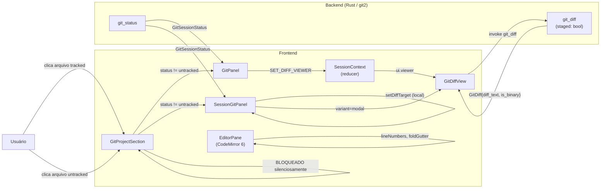
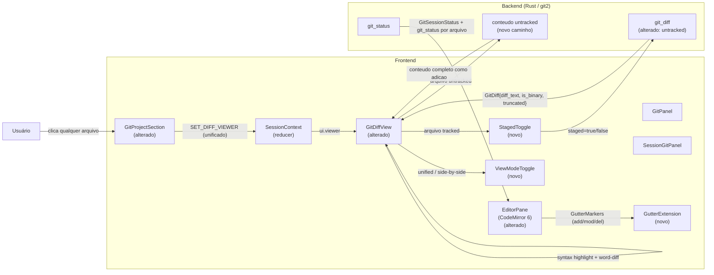

# SPEC: git-changes-visibility

## Metadata
- Jira: N/A — demanda direta do dono do repositório
- Service: Entry IDE (desktop, Tauri 2 + React + Vite)
- Tier: standard
- Version: 1.1
- Date: 2026-07-09
- Architecture references: `ARCHITECTURE.md`, `CLAUDE.md`, `DESIGN_PRINCIPLES.md`
  (AGENTS.md ausente no repositório — sem fallback disponível)

---

## Context

O painel Git do Entry IDE lista arquivos modificados (staged, unstaged, untracked), mas clicar em um arquivo frequentemente não exibe nenhum diff. A investigação (`RESEARCH.md`) identificou quatro causas raiz:

1. `GitProjectSection.tsx:224` bloqueia cliques em arquivos `untracked` silenciosamente.
2. O backend (`git/mod.rs`) não gera conteúdo de diff para arquivos untracked — retorna diff vazio.
3. `GitPanel` despacha `SET_DIFF_VIEWER` (side viewer global); `SessionGitPanel` usa `diffTarget` local + modal — comportamento divergente nas duas superfícies.
4. Diff truncado por `MAX_DIFF_BYTES` (`mod.rs:1021`) seta `is_binary = true`, fazendo o frontend renderizar "Binary file" em vez de uma mensagem descritiva.

Além do bug, o usuário confirmou quatro capacidades desejadas:

1. **Bug fix**: clique em qualquer arquivo (incluindo untracked) abre visualização de diff/conteúdo; comportamento unificado entre `GitPanel` e `SessionGitPanel`.
2. **Diff untracked + alternância staged/unstaged**: untracked exibe conteúdo completo como adição; arquivos tracked alternam entre diff staged e unstaged via toggle.
3. **Diff rico**: syntax highlight, toggle unified/side-by-side, word-level diff intra-linha.
4. **Gutter de mudanças no editor**: marcadores add/mod/del na margem do CodeMirror 6 (estilo VS Code).

Restrição arquitetural central (`ARCHITECTURE.md` — "Key Design Decisions"): todo estado de sessão vive em um único `useReducer` em `SessionContext`; ações derivadas de git (como abrir o viewer) devem ser despachadas via ações do reducer, não gerenciadas em estado local de componente. `CLAUDE.md` reforça: TypeScript strict, CSS por componente em `src/styles/` (sem CSS-in-JS), componentes funcionais com hooks.

`DESIGN_PRINCIPLES.md` — Princípio 2 (Fast by default): qualquer nova dependência (ex.: biblioteca de diff side-by-side ou syntax highlight) deve justificar o peso em performance de startup e tamanho do bundle.

---

## AS IS — Estado atual



`GitPanel` e `SessionGitPanel` têm comportamentos divergentes ao abrir o diff (side viewer global vs. modal local). Arquivos untracked nunca abrem diff — clique é bloqueado no frontend e o backend não gera conteúdo para esse status. Diff truncado por tamanho exibe "Binary file" mesmo quando o arquivo é texto.

---

## TO BE — Estado proposto



Após a implementação: qualquer arquivo no painel git abre visualização (RF-01, RF-02); untracked exibe conteúdo completo como adição (RF-03); o diff viewer oferece toggle staged/unstaged, syntax highlight, unified/side-by-side e word-level diff (RF-04, RF-05, RF-06, RF-07); o editor exibe gutter de mudanças por linha (RF-08); diffs truncados exibem mensagem textual em vez de "Binary file" (RF-09). `GitPanel` e `SessionGitPanel` usam o mesmo caminho de dispatch via `SET_DIFF_VIEWER` (RF-02).

---

## Scope

- **In:**
  - Correção do clique bloqueado para arquivos untracked em `GitProjectSection` (bug)
  - Unificação do comportamento de abertura de diff entre `GitPanel` e `SessionGitPanel`
  - Geração de diff/conteúdo para arquivos untracked no backend
  - Toggle staged/unstaged no viewer
  - Syntax highlight no viewer de diff
  - Toggle unified/side-by-side no viewer
  - Word-level diff intra-linha no viewer
  - Gutter de mudanças no editor CodeMirror 6
  - Correção da mensagem para diff truncado (não mais "Binary file")

- **Out:**
  - Diff para arquivos em conflito de merge (já tratado por `GitConflictViewer`)
  - Diff inline no painel git (tipo GitHub PR) — não está no escopo confirmado
  - Integração com blame ou histórico de linha
  - Diff para arquivos binários reais (comportamento atual mantido)
  - Qualquer mudança em `GitLogView`, `GitStashSection`, `GitBranchSelector`

---

## RIGID (Non-Negotiable)

### Functional Requirements

- **RF-01** [Conditional]: QUANDO o usuário clicar em qualquer arquivo listado no painel git — independentemente do status (`staged`, `unstaged`, `untracked`) — o sistema DEVE abrir a visualização de diff/conteúdo para esse arquivo.
  - AC: Dado um arquivo com `status = "untracked"` visível no painel git, ao clicar nele, a visualização de diff/conteúdo abre sem nenhuma mensagem de erro; pass = visualização abre; fail = nada acontece ou erro é exibido.

- **RF-02** [State-Driven]: O estado de "arquivo selecionado para diff" DEVE ser gerenciado exclusivamente via a ação `SET_DIFF_VIEWER` do reducer em `SessionContext` (verified at `src/state/SessionContext.tsx:938`), tanto para `GitPanel` quanto para `SessionGitPanel`. Nenhuma das duas superfícies pode manter estado local de diff target que diverge do reducer.
  - AC: Dado que o usuário abre um diff via `GitPanel` e depois via `SessionGitPanel` na mesma sessão, em ambos os casos `ui.viewer` em `SessionContext` reflete o arquivo selecionado e a visualização é idêntica; pass = estado unificado; fail = comportamentos distintos entre as duas superfícies.

- **RF-03** [Conditional]: QUANDO o arquivo selecionado tiver `status = "untracked"`, o sistema DEVE exibir o conteúdo completo do arquivo formatado como adição pura (todas as linhas prefixadas com `+`), sem exigir que o arquivo esteja staged ou tracked.
  - AC: Dado um arquivo untracked com conteúdo texto, a visualização exibe todas as linhas do arquivo com o marcador de adição; pass = conteúdo visível como adição; fail = diff vazio, mensagem de erro ou "Binary file".

- **RF-04** [State-Driven]: Para arquivos com `area = "staged"` ou `area = "unstaged"`, o viewer DEVE exibir um controle de alternância entre "staged" e "unstaged". A alternância NÃO deve recarregar a página nem fechar o viewer; apenas o conteúdo do diff muda.
  - AC: Com um arquivo que possui tanto versão staged quanto unstaged, clicar no toggle altera o diff exibido sem fechar o viewer; pass = diff muda no lugar; fail = viewer fecha ou nenhuma mudança ocorre.

- **RF-05** [Unwanted]: O viewer de diff NÃO DEVE exibir "Binary file" quando o motivo for truncamento por tamanho — somente quando o arquivo for genuinamente binário (contém bytes nulos detectados pelo backend).
  - AC: Dado um arquivo texto grande cujo diff excede `MAX_DIFF_BYTES` (`src-tauri/src/git/mod.rs:194`), o viewer exibe uma mensagem textual descritiva indicando que o diff é parcial ou grande demais, e NÃO exibe "Binary file"; pass = mensagem descritiva visível; fail = "Binary file" aparece para arquivo texto truncado.

- **RF-06** [Event-Driven]: QUANDO o usuário ativar o modo "side-by-side" no viewer, o sistema DEVE apresentar as linhas removidas e adicionadas em colunas paralelas na mesma linha de diff. O modo padrão é "unified" (comportamento atual).
  - AC: Com o toggle em "side-by-side", linhas `+` e `-` de um mesmo hunk aparecem em colunas lado a lado; pass = layout de duas colunas visível; fail = layout permanece unified.

- **RF-07** [State-Driven]: No modo unified e no modo side-by-side, o viewer DEVE aplicar syntax highlight ao conteúdo do diff baseado na extensão do arquivo (ex.: `.ts`, `.rs`, `.py`). O highlight NÃO pode introduzir latência de abertura do viewer superior a 300ms para arquivos com até 500 linhas de diff em hardware de referência (MacBook M1).
  - AC (funcional): Dado um arquivo `.ts` com diff, as palavras-chave TypeScript são destacadas com cores distintas no viewer; pass = highlight visível; fail = texto monocromático.
  - AC (performance): Dado um diff de 500 linhas, o viewer abre e renderiza em menos de 300ms após o clique; pass = renderização concluída em < 300ms; fail = latência igual ou superior a 300ms.

- **RF-08** [State-Driven]: O editor CodeMirror 6 (`src/editor/EditorPane.tsx`) DEVE exibir marcadores na gutter para linhas com mudanças git em relação ao HEAD: verde para linhas adicionadas, amarelo/laranja para linhas modificadas, e um marcador de exclusão (triângulo ou traço) na posição onde linhas foram removidas.
  - AC: Dado um arquivo aberto no editor com modificações git (unstaged), a gutter ao lado dos números de linha exibe marcadores coloridos nas linhas afetadas; pass = marcadores visíveis e corretos por tipo (add/mod/del); fail = gutter sem marcadores ou marcadores errados.

- **RF-09** [Conditional]: QUANDO o diff de um arquivo for truncado por exceder `MAX_DIFF_BYTES` (`src-tauri/src/git/mod.rs:194`), o payload retornado pelo backend DEVE incluir um campo `truncated: bool = true` separado de `is_binary`. O frontend DEVE usar `truncated` para exibir uma mensagem diferenciada e NÃO deve setar `is_binary = true` somente por causa do truncamento.
  - AC: Dado um arquivo texto com diff > `MAX_DIFF_BYTES`, `GitDiff.is_binary` é `false` e `GitDiff.truncated` é `true`; o viewer exibe mensagem de "diff truncado" e não "Binary file"; pass = campos corretos e mensagem correta; fail = `is_binary = true` para arquivo texto ou mensagem errada.

### UI Requirements

- **UI-01** [State-Driven]: O controle de alternância staged/unstaged (RF-04) DEVE ser visível somente quando o arquivo tiver mudanças em ambas as áreas. Quando o arquivo tiver mudanças apenas em uma área, o controle NÃO é exibido.
  - AC: Arquivo com mudanças apenas unstaged: toggle não aparece no header do viewer; arquivo com mudanças em staged e unstaged: toggle aparece; pass = visibilidade condicional correta; fail = toggle sempre visível ou nunca visível.

- **UI-02** [State-Driven]: O controle de alternância unified/side-by-side (RF-06) DEVE ser visível no header do viewer para qualquer arquivo tracked ou untracked com conteúdo exibível. O estado do toggle (unified ou side-by-side) DEVE persistir durante a sessão — trocar de arquivo não reinicia a preferência.
  - AC: O usuário seleciona "side-by-side", depois clica em outro arquivo; o viewer abre no modo side-by-side; pass = preferência mantida; fail = modo retorna para unified a cada troca de arquivo.

- **UI-03** [Unwanted]: Os marcadores de gutter do editor (RF-08) NÃO DEVEM deslocar o conteúdo do editor — a gutter de mudanças git DEVE ser adicionada à mesma faixa de gutters existente (linha numbers, fold gutter) sem introduzir scroll horizontal.
  - AC: Com arquivo aberto e modificações visíveis, o conteúdo do editor não sofre deslocamento horizontal; a linha de código mais longa continua alinhada como antes; pass = sem deslocamento; fail = scroll horizontal aparece ou linhas desalinham.

- **UI-04** [Conditional]: QUANDO o diff de um arquivo for truncado (RF-09, `truncated = true`), o viewer DEVE exibir um aviso visível no header ou no rodapé do diff informando que o conteúdo está parcialmente exibido. O aviso DEVE incluir orientação para usar o terminal para ver o diff completo.
  - AC: Diff truncado: aviso textual visível no viewer com referência ao terminal; pass = aviso presente; fail = aviso ausente ou usuário não sabe que o diff está incompleto.

### Contracts

- **CT-01** [IPC — backend → frontend]: O tipo `GitDiff` retornado por `git_diff` (`src-tauri/src/git/mod.rs:980`) DEVE ser estendido com o campo `truncated: bool`. Quando o diff for truncado por `MAX_DIFF_BYTES`, `truncated = true` e `is_binary` reflete exclusivamente a natureza binária real do arquivo.

  Assinatura atual (verificada em `src-tauri/src/git/mod.rs:148` e `src/types/git.ts:33`):
  ```
  GitDiff { path, diff_text, is_binary, additions, deletions }
  ```
  Assinatura proposta:
  ```
  GitDiff { path, diff_text, is_binary, truncated, additions, deletions }
  ```
  - AC: O campo `truncated` está presente no tipo Rust (`struct GitDiff`) e no tipo TypeScript (`GitDiff` em `src/types/git.ts`); qualquer consumidor que omitir `truncated` falha na compilação TypeScript strict; pass = ambas as tipagens incluem o campo; fail = campo ausente em qualquer uma das camadas.

- **CT-02** [IPC — backend para untracked]: Para arquivos com `status = "untracked"`, o backend DEVE retornar um `GitDiff` válido com `diff_text` contendo o conteúdo completo do arquivo prefixado como adição, `is_binary = false` (para arquivos texto), `truncated = false` (se dentro do limite), e `additions` igual ao número de linhas do arquivo.
  - AC: `invoke("git_diff", { ..., staged: false })` para um arquivo untracked retorna `GitDiff` com `diff_text` não vazio e `additions > 0`; pass = payload correto; fail = diff vazio ou erro IPC.

### Non-Functional Requirements

- **RNF-01**: A adição do gutter de mudanças git no editor (RF-08) NÃO DEVE aumentar o tempo de inicialização de uma sessão existente em mais de 50ms, medido do evento de montagem do `EditorPane` até o primeiro frame renderizado com o editor interativo.
  - AC: Perfil de performance (Chrome DevTools) antes e depois: diferença no tempo de mount do editor menor que 50ms; pass = delta < 50ms; fail = delta >= 50ms.

- **RNF-02**: O diff rico (RF-06, RF-07) DEVE usar os language packs do CodeMirror 6 já presentes no projeto (reuso via `EditorPane`) para syntax highlight — nenhuma dependência adicional de highlight é permitida. O delta de bundle esperado para essa decisão é ~0. Para quaisquer outras dependências introduzidas pela feature (ex.: virtualização de lista), o bundle final NÃO DEVE aumentar em mais de 150 KB (gzip).
  - AC: Tamanho do bundle (`npm run build` + análise de `dist/`) com a feature vs. sem a feature: delta < 150 KB gzip; pass = delta < 150 KB; fail = delta >= 150 KB.

- **RNF-03**: Todo código TypeScript produzido DEVE compilar sem erros em modo strict (`npx tsc --noEmit`). Todo código Rust DEVE passar em `cargo clippy -- -D warnings` e `cargo fmt --check` sem diff.
  - AC: `npx tsc --noEmit` e `cargo clippy -- -D warnings` retornam exit code 0 após a implementação; pass = exit 0; fail = qualquer warning ou erro.

---

## FLEXIBLE (Implementation Suggestions)

As sugestões abaixo são internas à implementação e NÃO são contratos. O implementador pode divergir com justificativa técnica.

- **Syntax highlight e word-level diff**: Usar os language packs do CodeMirror 6 já presentes no projeto (via `EditorPane.tsx`) para syntax highlight no diff viewer. A escolha está fixada em RIGID (RNF-02) — Shiki e Prism não devem ser considerados.

- **Word-level diff**: Implementar via algoritmo de diff de tokens simples (ex.: separar por espaço e símbolo) sem uma biblioteca completa de diff de caracteres. Para a maioria dos casos de uso (código), a granularidade por token é suficiente e mais performática.

- **Side-by-side**: O layout de duas colunas pode ser implementado com CSS Grid nativo (sem dependência de biblioteca de tabelas virtualizadas), desde que o número de linhas por diff seja limitado (< 2000 linhas). Para diffs maiores, considerar virtualização com `react-window` — mas avaliar o impacto no bundle antes.

- **Gutter do editor**: Utilizar a API `GutterMarker` e `gutter()` do CodeMirror 6 (`@codemirror/view`). A extensão deve buscar o status git atual via o hook `useGitStatus` (já presente, verified at `src/hooks/`) e derivar os marcadores por linha a partir do diff do arquivo aberto. Evitar nova chamada IPC por linha — usar o diff já carregado.

- **Unificação GitPanel/SessionGitPanel**: A função `handleFileClick` em `GitProjectSection` pode receber um `onDiffFile` normalizado que sempre despacha `SET_DIFF_VIEWER`, eliminando a bifurcação. `SessionGitPanel` pode remover o estado `diffTarget` local após a migração.

- **CSS**: Estilos do diff viewer rico devem ir em `src/styles/GitDiffView.css` (arquivo já existente). Estilos do gutter em `src/styles/EditorPane.css` (criar se não existir). Nenhum CSS-in-JS — conforme `CLAUDE.md`.

- **Estado do toggle unified/side-by-side**: Pode ser armazenado em `SessionContext` via nova ação `SET_DIFF_VIEW_MODE` ou em `localStorage` com chave por sessão. A segunda opção persiste entre reinicializações sem alterar o reducer, mas viola levemente o princípio de estado centralizado. A primeira é preferida para consistência.

---

## Acceptance Criteria Summary

| ID | Critério | Testável? |
|----|----------|-----------|
| RF-01 | Clique em arquivo untracked abre visualização | Sim |
| RF-02 | Estado diff unificado via `SET_DIFF_VIEWER` em ambas as superfícies | Sim |
| RF-03 | Untracked exibe conteúdo completo como adição | Sim |
| RF-04 | Toggle staged/unstaged muda diff sem fechar viewer | Sim |
| RF-05 | Diff truncado não exibe "Binary file" | Sim |
| RF-06 | Toggle side-by-side exibe colunas paralelas | Sim |
| RF-07 (funcional) | Syntax highlight por extensão de arquivo | Sim |
| RF-07 (perf) | Viewer abre em < 300ms para 500 linhas | Sim (medição manual) |
| RF-08 | Gutter com marcadores add/mod/del no editor | Sim |
| RF-09 | Campo `truncated` separado de `is_binary` no payload | Sim |
| UI-01 | Toggle staged/unstaged visível apenas quando ambas as áreas têm mudanças | Sim |
| UI-02 | Preferência unified/side-by-side persiste durante a sessão | Sim |
| UI-03 | Marcadores de gutter não deslocam conteúdo | Sim (visual) |
| UI-04 | Aviso visível quando diff truncado | Sim |
| CT-01 | `GitDiff.truncated: bool` presente em Rust e TypeScript | Sim (compilação) |
| CT-02 | `git_diff` retorna conteúdo válido para untracked | Sim (invoke direto) |
| RNF-01 | Mount do editor sem aumento > 50ms | Sim (DevTools) |
| RNF-02 | Bundle delta < 150 KB gzip | Sim (build analysis) |
| RNF-03 | `tsc --noEmit` e `cargo clippy` sem erros | Sim (CI) |

---

## Markers

- **[RESOLVED] RNF-02** (2026-07-09, checkpoint humano — dono do repositório): Syntax highlight via CodeMirror 6 language packs já presentes no projeto (reuso do que `EditorPane` usa). Shiki e Prism descartados. Delta de bundle esperado ~0. O limite de 150 KB gzip permanece como guarda para outras dependências eventuais da feature (ex.: virtualização). Decisão fixada como RIGID em RNF-02.

---

## Distribution by Repo

Repositório único: `/Users/aleff.porto/person/entry-ide`

| Camada | Arquivos afetados | RFs cobertos |
|--------|-------------------|--------------|
| Backend Rust (`src-tauri/src/git/mod.rs`) | `git_diff`, struct `GitDiff` | RF-03, RF-09, CT-01, CT-02 |
| Tipos compartilhados (`src/types/git.ts`) | struct `GitDiff` | CT-01 |
| Componente (`src/components/GitProjectSection.tsx`) | `handleFileClick` | RF-01 |
| Componente (`src/components/SessionGitPanel.tsx`) | remover `diffTarget` local | RF-02 |
| Componente (`src/components/GitDiffView.tsx`) | viewer completo | RF-04, RF-05, RF-06, RF-07, UI-01, UI-02, UI-04 |
| Editor (`src/editor/EditorPane.tsx`) | extensão gutter | RF-08, UI-03 |
| Estilos (`src/styles/GitDiffView.css`) | CSS do diff rico | RF-06, RF-07 |
| Estilos (`src/styles/EditorPane.css`) | CSS do gutter | RF-08 |
