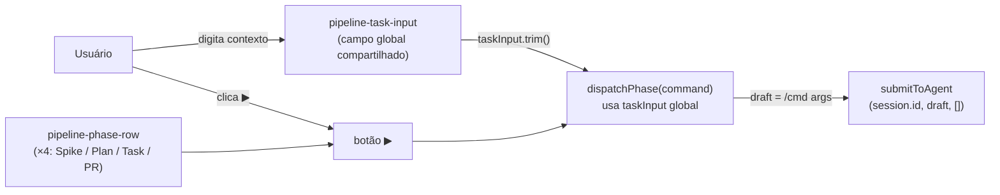
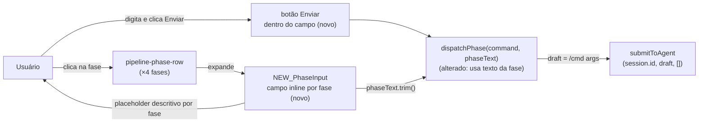

# SPEC: pipeline-per-phase-input

## Metadata
- Jira: N/A (free-text feature request)
- Service: Entry IDE — PipelinePanel (Workbench tab, agent sessions)
- Tier: light
- Version: 1.0
- Architecture references: CLAUDE.md, docs/FEATURE-PLAN.md, docs/adr/001-agent-mode.md

## Context

O painel Pipeline (aba Workbench de sessões agent) expõe as quatro fases do workflow SDD (Spike, Plan, Task, PR) como linhas clicáveis. Hoje existe um único campo de texto compartilhado (`pipeline-task-input`) acima das fases; ao clicar o botão ▶ de qualquer fase, o texto desse campo é anexado ao comando: `/${command} <taskInput>`.

O problema é que o campo compartilhado não comunica o que cada fase espera como entrada — a semântica de `taskInput` para `/harness-cmd:spike` é diferente da de `/harness-cmd:task`. O desenvolvedor pediu que o clique na fase abra um campo de entrada inline específico para aquela fase, com placeholder descritivo, substituindo o campo global.

Restrições arquiteturais relevantes (verificadas nas fontes acima):
- `docs/FEATURE-PLAN.md` §2.2: "Disparo de fase = `sendAgentInput` com o slash command correspondente." O painel é atalho, não segundo caminho de execução. A implementação DEVE continuar a usar `submitToAgent` como único mecanismo de dispatch.
- `docs/adr/001-agent-mode.md`: o compositor escreve eventos JSON para o stdin do subprocesso; o painel não deve criar um novo caminho de input paralelo.
- `CLAUDE.md`: TypeScript strict mode; CSS por componente em `src/styles/`; sem CSS-in-JS; componentes funcionais com hooks; estado de sessão em `SessionContext`.

A mudança é puramente frontend — sem contrato de API novo, sem alteração em `pipelinePhases.ts` ou `usePipelineState.ts`.

## AS IS — Estado atual

O campo `pipeline-task-input` é único e vive acima das quatro fases. Qualquer texto digitado nele é enviado indiscriminadamente junto com qualquer fase disparada. Não há descrição do que cada fase espera como argumento.

## TO BE — Estado proposto

O campo global é removido. Cada fase pode ser expandida individualmente para revelar um campo inline com placeholder específico e um botão de envio. O dispatch continua via `submitToAgent`, realizando RF-01, RF-02, RF-03, UI-01, UI-02, UI-03.

## Scope
- **In**: remoção do `pipeline-task-input` compartilhado; adição de campo de entrada inline expansível por fase; placeholder descritivo por fase; botão de envio por fase; comportamento de expansão/colapso; estado disabled durante `isStreaming`.
- **Out**: alterações em `pipelinePhases.ts`, `usePipelineState.ts`, `submitToAgent`, backend Rust, lógica de estado de pipeline (derivação de worktree), `PipelineStrip` (componente in-chat separado), qualquer mudança de contrato de IPC.

## RIGID (Non-Negotiable)

### Functional Requirements

- RF-01 [State-Driven]: Quando o painel Pipeline é renderizado, o elemento `pipeline-task-input` compartilhado NÃO deve existir no DOM. Nenhum campo de texto global acima das fases deve ser renderizado.
  - AC: Inspecionar o DOM do painel montado: nenhum elemento com classe `pipeline-task-input` está presente. Verificável via teste unitário / snapshot.

- RF-02 [Event-Driven]: Quando o usuário clica em uma linha de fase (ou em uma área de ativação claramente delimitada dentro da linha), um campo de entrada inline específico para aquela fase é exibido imediatamente abaixo da linha de cabeçalho da fase, dentro do mesmo item `<li>`.
  - AC: Após o clique, o DOM do `<li>` da fase clicada contém exatamente um elemento `<input>` (ou `<textarea>`) de texto visível. As demais fases não exibem campo de entrada como resultado desse clique.
  - [NEEDS CLARIFICATION] O clique no botão de envio (▶ ou novo botão de envio) também deve abrir o campo antes de enviar, ou o botão de envio só aparece depois que o campo está aberto? A distinção afeta se o ▶ original é mantido, substituído ou ocultado.

- RF-03 [Event-Driven]: Quando o usuário aciona o envio da fase (botão de envio dentro do campo expandido), o sistema deve chamar `submitToAgent` com o draft `/${command} ${phaseText.trim()}` quando `phaseText` não estiver vazia, ou `/${command}` quando estiver vazia — idêntico ao comportamento atual de `dispatchPhase`, mas usando o texto do campo da fase ao invés do `taskInput` global.
  - AC: Após o acionamento do envio, `submitToAgent` é chamado com `session.id` e o draft correto. Verificável via mock/spy de `submitToAgent` em teste unitário.

- RF-04 [Unwanted]: Quando `isStreaming` é `true`, o botão de envio do campo expandido de qualquer fase NÃO deve ser acionável (deve estar `disabled`).
  - AC: Com `isStreaming=true`, o atributo `disabled` está presente no botão de envio de cada fase. Clicar no botão não chama `submitToAgent`.

- RF-05 [State-Driven]: O placeholder do campo de entrada de cada fase deve ser distinto e descritivo do que aquela fase espera como argumento.
  - AC: Os quatro campos expandidos exibem textos de placeholder diferentes entre si. Cada placeholder é não vazio.
  - [NEEDS CLARIFICATION] Os placeholders exatos por fase precisam ser definidos pelo desenvolvedor/produto. Candidatos prováveis — Spike: "ex.: CRED-1234 — descreva o problema a investigar"; Plan: "ex.: CRED-1234 ou caminho do SPIKE.md"; Task: "ex.: instrução adicional ou deixe vazio para usar o PLAN.md"; PR: "ex.: contexto extra para o PR ou deixe vazio" — mas estes são sugestões, não RIGID até confirmação.

### UI Requirements

- UI-01 [Conditional]: Quando o campo inline de uma fase está visível e `isStreaming` é `false`, o campo de entrada deve estar focado automaticamente imediatamente após a expansão.
  - AC: Após o clique que expande a fase, `document.activeElement` é o `<input>` ou `<textarea>` recém-exibido. Verificável via teste de DOM.

- UI-02 [State-Driven]: O campo inline expandido deve exibir um botão de envio (label sugerido: "Enviar" ou ícone equivalente) que ao ser acionado executa RF-03.
  - AC: O DOM do campo expandido contém um `<button>` de submit dentro ou adjacente ao campo. O botão está presente independentemente do conteúdo do campo.

- UI-03 [State-Driven]: Os estilos do campo inline e do botão de envio devem estar exclusivamente em `src/styles/components/PipelinePanel.css`, usando tokens CSS (`var(--bg-*)`, `var(--text-*)`, `var(--accent)`, `var(--rule)`) presentes no arquivo CSS atual. Nenhum estilo inline (`style={}`) deve ser introduzido.
  - AC: O arquivo `PipelinePanel.tsx` não contém nenhum atributo `style={{...}}` relacionado ao campo inline. As classes novas existem em `PipelinePanel.css` e referenciam apenas tokens já definidos no tema.

### Contracts

Nenhum contrato de API, IPC ou evento novo é introduzido. O mecanismo de dispatch permanece `submitToAgent` (verificado em `src/components/PipelinePanel.tsx:54`).

### Non-Functional Requirements

- RNF-01: A adição do campo inline não deve introduzir nenhum erro de TypeScript em modo strict. `npx tsc --noEmit` deve retornar exit code 0 após a mudança.
  - AC: `npx tsc --noEmit` passa sem erros no repositório após a implementação.

## FLEXIBLE (Implementation Suggestions)

- O estado de expansão pode ser modelado como `expandedPhase: PhaseKey | null` dentro de `PipelinePanel` (estado local do componente, não em `SessionContext` — a preferência de expansão não precisa sobreviver a remontagens do painel).
- O texto por fase pode ser modelado como `Record<PhaseKey, string>` inicializado com strings vazias, ou como `phaseTexts: Map<PhaseKey, string>`. A escolha impacta a clareza do tipo, mas ambos são válidos em strict TS.
- [NEEDS CLARIFICATION] Persistência de texto por fase: o texto digitado em uma fase deve ser limpo após o envio, ou mantido (para reenvio rápido)? Se mantido, deve ser limpo ao colapsar a fase?
- [NEEDS CLARIFICATION] Colapso automático: clicar em uma segunda fase deve colapsar a primeira automaticamente (accordion), ou múltiplas fases podem ficar expandidas simultaneamente? Accordion reduz o layout space e é mais previsível; múltiplas expandidas permite comparar placeholders.
- [NEEDS CLARIFICATION] Tecla Enter no campo inline deve acionar o envio (equivalente ao clique no botão de envio)? Comportamento padrão esperado para campos de texto de ação única.
- A arquitetura de delegação da FEATURE-PLAN.md ("painel é atalho, não segundo caminho") já é satisfeita por RF-03 — nenhuma lógica de orquestração deve entrar em `PipelinePanel`.
- O hook `usePipelineState` não precisa de alteração; o estado de expansão e o texto por fase são preocupações puramente visuais do componente.
- Conforme `CLAUDE.md`: nenhuma dependência nova de biblioteca de UI deve ser introduzida; usar apenas React hooks nativos (`useState`, `useCallback`, `useRef`).

## Acceptance Criteria Summary

| ID | Criterion | Testable? |
|----|-----------|-----------|
| RF-01 | `pipeline-task-input` ausente do DOM após montagem | Sim — snapshot/DOM query |
| RF-02 | Clique na fase exibe campo inline naquela fase; demais não exibem | Sim — teste de interação |
| RF-03 | Envio chama `submitToAgent` com draft correto por fase | Sim — mock/spy unitário |
| RF-04 | Botão de envio `disabled` quando `isStreaming=true` | Sim — teste com prop mock |
| RF-05 | Placeholders distintos e não vazios por fase | Sim — snapshot |
| UI-01 | Campo recebe foco automaticamente ao expandir | Sim — `document.activeElement` |
| UI-02 | Botão de envio presente no DOM do campo expandido | Sim — DOM query |
| UI-03 | Sem `style={{}}` em `PipelinePanel.tsx`; classes em `PipelinePanel.css` | Sim — lint/grep no arquivo |
| RNF-01 | `tsc --noEmit` passa sem erros | Sim — CI |
