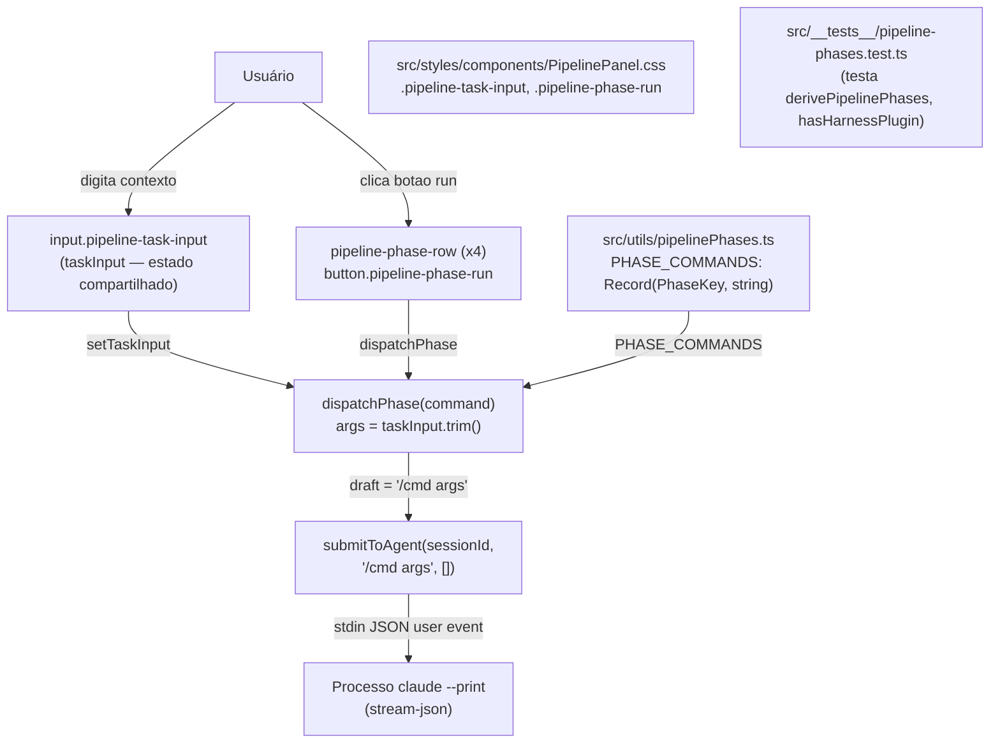
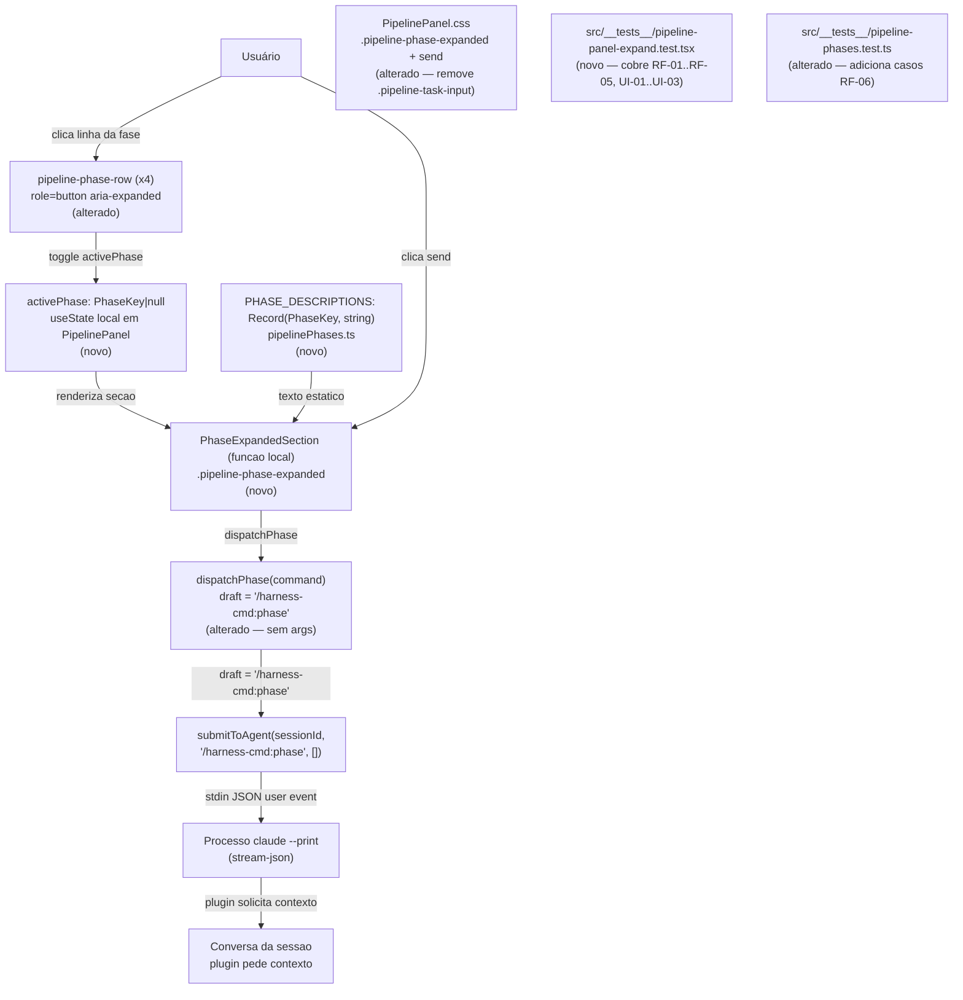

# Implementation Plan

## Request Summary

- **Objective**: Rewrite PipelinePanel to the v2.0 design — remove shared text input and per-row run button; add per-phase expandable section with static description and a bare-command send button; extract `PHASE_DESCRIPTIONS` constant; cover all RIGID ACs with new tests.
- **Scope in**: `src/utils/pipelinePhases.ts`, `src/components/PipelinePanel.tsx`, `src/styles/components/PipelinePanel.css`, `src/__tests__/pipeline-phases.test.ts` (additive), `src/__tests__/pipeline-panel-expand.test.tsx` (new file).
- **Scope out**: any text field inside the panel; persistence of expansion state; multiple concurrent expanded phases; changes to `usePipelineState`, `submitToAgent`, or any harness plugin behavior; contract artifacts (no `### Contracts` subsection in SPEC).
- **Tier**: standard
- **Architecture references**:
  - `CLAUDE.md` — functional components + hooks; state in `useState` local to the component (ephemeral UI state) or `SessionContext` (session state); CSS per-component in `src/styles/components/`; strict TypeScript; no CSS-in-JS.
  - `docs/adr/001-agent-mode.md` — `submitToAgent` is the sole execution path for agent input; the panel is a shortcut, not a second channel. Business logic must not live in the component (ADR 001 §Implementation: "Dispatching a phase sends the plugin's slash command through the normal chat — identical to typing it").

> **Architecture warning**: no `AGENTS.md` or `docs/agents/` tree found in this repo. All architecture guidance is derived exclusively from `CLAUDE.md` and `docs/adr/001-agent-mode.md` as specified in the SPEC. This plan names those sources for every architectural constraint cited.

---

## AS IS — Componentes impactados



O painel atual possui um campo de texto compartilhado no topo (`taskInput`/`.pipeline-task-input`) e um botao run (`pipeline-phase-run`) em cada linha de fase. `dispatchPhase` concatena o comando com o texto digitado antes de chamar `submitToAgent`. Nenhum estado de expansao existe.

---

## TO BE — Componentes propostos



Apos a execucao do plano: o campo compartilhado e os botoes run por linha sao eliminados; cada linha de fase torna-se um elemento acionavel que expande uma secao estatica com descricao e botao send. T01 produz `PHASE_DESCRIPTIONS` e atualiza `UpdatedPhaseTest`. T02 reescreve `PipelinePanel.tsx` (`PhaseRow` alterado, `NEW_ActivePhase`, `NEW_ExpandedSection`). T03 atualiza `PipelinePanel.css` (`PipelineCSS` alterado). T04 cria `NEW_ExpandTest`.

---

## Tasks

### T01 — Adicionar `PHASE_DESCRIPTIONS` em `pipelinePhases.ts` e cobrir RF-06

- **Files**:
  - `src/utils/pipelinePhases.ts`
  - `src/__tests__/pipeline-phases.test.ts`
- **Change**:
  Adicionar logo apos `PHASE_COMMANDS` (linha 42) a constante exportada:
  ```ts
  export const PHASE_DESCRIPTIONS: Record<PhaseKey, string> = {
    spike: "investigacao/discovery — o plugin pedira chave Jira ou tema ao iniciar",
    plan: "gera SPEC.md + PLAN.md — o plugin pedira CRED-XXX ou descricao da task",
    task: "implementa o PLAN existente no worktree",
    pr: "abre pull request para o branch atual",
  };
  ```
  Os textos exatos sao FLEXIBLE; o que e RIGID e a existencia da exportacao, as quatro chaves e valores nao-vazios (RF-06 AC).

  Em `pipeline-phases.test.ts`, adicionar um `describe("PHASE_DESCRIPTIONS (RF-06)")` com tres `it`: (1) importa sem erro — verificado pelo proprio `describe` existir; (2) `Object.keys(PHASE_DESCRIPTIONS)` e identico a `['spike', 'plan', 'task', 'pr']`; (3) cada valor e `string` com `length > 0`.

- **Covers**: RF-06
- **Tests**: `src/__tests__/pipeline-phases.test.ts` — tres casos adicionados ao describe existente.
- **Risk**: Low — adicao pura a um modulo de utilitario sem React. Zero risco de regressao nas funcoes existentes.
- **Dependencies**: none

---

### T02 — Reescrever `PipelinePanel.tsx`: remover `taskInput`/run-button, adicionar `activePhase` e `PhaseExpandedSection`

- **Files**:
  - `src/components/PipelinePanel.tsx`
- **Change**:
  1. Remover o estado `const [taskInput, setTaskInput] = useState("")` e o `<input className="pipeline-task-input" ...>`.
  2. Adicionar `const [activePhase, setActivePhase] = useState<PhaseKey | null>(null)` — estado local efemero (CLAUDE.md: estado de UI local fica em `useState` no componente, nao em `SessionContext`).
  3. Simplificar `dispatchPhase` para: `draft = \`/${command}\`` sem args — alinhado ao ADR 001: o componente so passa o comando; a logica de contexto e responsabilidade do plugin.
  4. Remover `taskInput` do array de dependencias do `useCallback` de `dispatchPhase`.
  5. Definir funcao `togglePhase` (pode ser `useCallback`) que: (a) ignora o clique se `isStreaming === true` (RF-04); (b) se `activePhase === phase.key`, seta `null` (toggle fechar, RF-02 AC toggle); (c) caso contrario, seta `phase.key` (abre/troca, RF-02 AC abertura/troca).
  6. Converter `<div className="pipeline-phase-row">` em elemento acionavel: adicionar `role="button"`, `tabIndex={0}`, `aria-expanded={activePhase === phase.key}`, `aria-disabled={isStreaming ? true : undefined}`, handler `onClick={() => togglePhase(phase.key)}`, handler `onKeyDown` que chama `togglePhase(phase.key)` ao receber `key === 'Enter'` ou `key === ' '` (UI-01).
  7. Remover o `<button className="pipeline-phase-run" ...>` do interior de `.pipeline-phase-row` (RF-05).
  8. Dentro do `<li>`, renderizar `{activePhase === phase.key && <PhaseExpandedSection ... />}` apos `.pipeline-phase-row` e antes de `.pipeline-phase-detail` (UI-02).
  9. Definir funcao local `PhaseExpandedSection({ phase, onSend, disabled }: { phase: PipelinePhase; onSend: () => void; disabled: boolean })`: retorna `<div className="pipeline-phase-expanded">` com `<p className="pipeline-phase-description">{PHASE_DESCRIPTIONS[phase.key]}</p>` e `<button className="pipeline-phase-send" onClick={onSend} disabled={disabled}>Enviar</button>` (RF-03, UI-03).
  10. Importar `PHASE_DESCRIPTIONS` de `../utils/pipelinePhases` (junto com `PhaseKey` e `PipelinePhase` que ja estao importados via `usePipelineState`).
  11. Executar `npx tsc --noEmit` ao final; zero `style={{` novos no arquivo (RNF-02).

  Nota de tamanho: `PipelinePanel.tsx` tem 168 linhas. A reescrita remove ~20 linhas e adiciona ~45 linhas. Projecao final: ~190 linhas, abaixo do `god_file_threshold = 500` de `.sensei/rules.toml`.

- **Covers**: RF-01, RF-02, RF-03, RF-04, RF-05, UI-01, UI-02, UI-03, RNF-01, RNF-02 (parcial — CSS fica em T03)
- **Tests**: T04 cobre os ACs de componente; `npx tsc --noEmit` valida tipagem ao final desta task.
- **Risk**: Medium — e a tarefa de maior superficie. Blast radius restrito a `PipelinePanel.tsx`; nenhum outro arquivo importa o componente. Rollback: reverter o commit de T02. Mitigacao: `npx tsc --noEmit` antes de concluir a task.
- **Dependencies**: T01 (importa `PHASE_DESCRIPTIONS` e `PhaseKey`)

---

### T03 — Atualizar `PipelinePanel.css`: remover `.pipeline-task-input`, adicionar seletores da secao expandida

- **Files**:
  - `src/styles/components/PipelinePanel.css`
- **Change**:
  1. Remover os blocos `.pipeline-task-input { ... }`, `.pipeline-task-input:focus { ... }`, `.pipeline-task-input::placeholder { ... }` (linhas 188-205 atuais).
  2. Remover os blocos `.pipeline-phase-run { ... }` e seus modificadores `:hover:not(:disabled)` e `:disabled` (linhas 104-121 atuais).
  3. Adicionar ao `.pipeline-phase-row` existente: `cursor: pointer;`. Adicionar seletor `[aria-disabled="true"].pipeline-phase-row { cursor: default; }` para o estado de streaming.
  4. Adicionar seletores para a secao expandida usando exclusivamente tokens CSS do tema (CLAUDE.md: CSS no arquivo per-componente, sem inline, sem CSS-in-JS — RNF-02):
     - `.pipeline-phase-expanded` — container flex-column, gap e padding alinhados ao restante do painel.
     - `.pipeline-phase-description` — texto estatico em `var(--text-2)`, tamanho 11.5px.
     - `.pipeline-phase-send` — botao com borda `var(--accent)`, sem background no estado normal, com `color-mix` no hover.
     - `.pipeline-phase-send:disabled` — opacity 0.4, cursor default.
  5. Nenhum `transition` que bloqueie `pointer-events` antes de 100 ms (RNF-01).

- **Covers**: RNF-01, RNF-02
- **Tests**: inspecao de seletores no arquivo; `grep -n 'style={{' src/components/PipelinePanel.tsx` = zero novos.
- **Risk**: Low — CSS isolado no arquivo per-componente; sem impacto em outros componentes.
- **Dependencies**: T02 (os seletores novos referenciam classes introduzidas pelo markup de T02)

---

### T04 — Criar `pipeline-panel-expand.test.tsx` cobrindo RF-01 a RF-05 e UI-01 a UI-03

- **Files**:
  - `src/__tests__/pipeline-panel-expand.test.tsx` (arquivo novo)
- **Change**:
  Criar o arquivo seguindo o padrao de `src/__tests__/mcp-panel.test.tsx` (jsdom environment, `@testing-library/react`, `fireEvent`, `vi.mock` para Tauri). Estrutura:

  - Header `// @vitest-environment jsdom`.
  - Mocks: `vi.mock("@tauri-apps/api/core", () => ({ invoke: vi.fn() }))`, `vi.mock("../hooks/usePipelineState", ...)`, `vi.mock("../api/projects", ...)`, `vi.mock("../utils/submitToAgent", ...)`.
  - `usePipelineState` mock retorna `{ phases: derivePipelinePhases(null, null), pipeline: null, loading: false, refresh: vi.fn(), isStreaming: false, pluginMissing: false }`.
  - `submitToAgent` mock e `vi.fn(() => Promise.resolve())`.
  - Session fixture: objeto `SessionData` minimo com `id: "test-session"` e `mode: "agent"`.

  Suites a implementar:

  **RF-01** — "painel sem expansao inicial": `querySelectorAll('.pipeline-phase-expanded').length === 0` e `querySelectorAll('input[type="text"]').length === 0`.

  **RF-02** — "toggle de expansao": tres `it` cobrindo abertura, troca e fechamento por toggle.

  **RF-03** — "draft exato no send": quatro `it` (ou `it.each`) verificando `submitToAgent` chamado com `"/harness-cmd:spike"`, `"/harness-cmd:plan"`, `"/harness-cmd:task"`, `"/harness-cmd:pr"` respectivamente.

  **RF-04** — "isStreaming bloqueia": rerender com `isStreaming: true`; verificar `disabled` no botao send e que `querySelectorAll('.pipeline-phase-expanded').length === 0` apos clique na row.

  **RF-05** — "elementos removidos ausentes": `querySelector('.pipeline-task-input') === null` e `querySelectorAll('.pipeline-phase-run').length === 0`.

  **UI-01** — "aria e teclado": verificar `role="button"`, `tabIndex={0}`, `aria-expanded` correto, `aria-disabled` no streaming, e que `fireEvent.keyDown(row, { key: 'Enter' })` e `fireEvent.keyDown(row, { key: ' ' })` acionam o toggle.

  **UI-02** — "ordem DOM": `li.children[1]` tem classe `pipeline-phase-expanded`.

  **UI-03** — "conteudo da secao": `getByText(PHASE_DESCRIPTIONS.spike)` nao lanca; `querySelector('.pipeline-phase-expanded input') === null`; `getAllByRole('button', { name: /enviar|send/i }).length === 1`.

  `afterEach(() => cleanup())` em cada `describe`.

- **Covers**: RF-01, RF-02, RF-03, RF-04, RF-05, UI-01, UI-02, UI-03, RNF-01 (sincronicidade verificada pelos testes sincronos de jsdom)
- **Tests**: o proprio arquivo e o artefato de teste; validado por `npm run test`.
- **Risk**: Low — arquivo novo, sem impacto em producao. Risco de falso negativo se os mocks nao isolarem `usePipelineState` corretamente; mitigacao: seguir o padrao de `mcp-panel.test.tsx`.
- **Dependencies**: T01 (importa `PHASE_DESCRIPTIONS`), T02 (testa o componente reescrito)

---

## Execution Phases

| Phase | Tasks | Parallel-safe? |
|-------|-------|----------------|
| 1 — Utilitario puro | T01 | Sim (sem dependencias) |
| 2 — Componente e CSS | T02, depois T03 | Nao — T03 depende dos seletores de T02 |
| 3 — Testes de componente | T04 | Nao — depende de T01 e T02 |
| 4 — Validacao final | `npx tsc --noEmit` + `npm run test` | N/A — gate de qualidade |

---

## Risks

| Risk | Blast radius | Mitigation | Rollback |
|------|-------------|------------|----------|
| `PipelinePanel.tsx` ultrapassa `max_lines_per_file` do sensei | Apenas o componente; `max_lines_per_file = 500` nao e atingido (~190 linhas projetadas) | Manter `PhaseExpandedSection` como funcao local no mesmo arquivo (SPEC FLEXIBLE); nao criar novo arquivo | Nao aplicavel — threshold nao sera atingido |
| Mock de `usePipelineState` em T04 nao reflete `phase.command` correto para RF-03 | Testes de RF-03 podem falhar por draft errado | Usar `derivePipelinePhases(null, null)` no setup do mock para garantir que `phase.command` coincide com `PHASE_COMMANDS` | Ajustar setup do mock |
| `.pipeline-task-input` removida do CSS e usada por outro componente | Zero — escopo CSS e per-componente (CLAUDE.md); grep confirmou que a classe so existe em `PipelinePanel.css` e `PipelinePanel.tsx` | Verificado por grep antes de planejar | Reintroduzir seletor se encontrado |
| `aria-disabled` em `div[role="button"]` nao bloqueia cliques nativos do browser | Clicar row com `isStreaming` dispararia `togglePhase` sem o guard | Guard `if (isStreaming) return;` no inicio de `togglePhase` e a barreira real; `aria-disabled` e apenas sinalizacao semantica | Confirmar guard esta antes de qualquer `setActivePhase` |

---

## Open Questions

Nenhuma questao bloqueante identificada. O escopo e totalmente contido em `entry-ide`, os ACs sao verificaveis e as convencoes de arquitetura estao claras nos documentos referenciados.

---

## Assumptions

- `submitToAgent` exportado de `src/utils/submitToAgent` (verificado: importado em `PipelinePanel.tsx` linha 19) aceita `(sessionId: string, draft: string, attachments: never[]) => Promise<void>` — o componente atual ja passa `/${command}` com a barra; a funcao nao adiciona barra internamente.
- `usePipelineState` retorna `isStreaming: boolean` diretamente (verificado: desestruturado na linha 29 de `PipelinePanel.tsx`).
- `PhaseKey` e `PipelinePhase` sao tipos exportados de `src/utils/pipelinePhases.ts` (verificados: linhas 19 e 22).
- Nenhum teste existente referencia `.pipeline-task-input`, `.pipeline-phase-run` ou `taskInput` diretamente (verificado: grep em `src/__tests__/` retornou zero ocorrencias).
- `framework-metrics.test.ts` e `framework-aggregates.test.ts` nao importam `PipelinePanel` — [UNVERIFIED] pela leitura completa desses arquivos; confirmar se `npm run test` falhar nesses suites apos T02.

---

## Beads task graph

- [ ] T01 — Adicionar PHASE_DESCRIPTIONS em pipelinePhases.ts e casos RF-06 em pipeline-phases.test.ts
      Depends: —
- [ ] T02 — Reescrever PipelinePanel.tsx: remover taskInput/run-button, adicionar activePhase e PhaseExpandedSection
      Depends: T01
- [ ] T03 — Atualizar PipelinePanel.css: remover pipeline-task-input/pipeline-phase-run, adicionar seletores da secao expandida
      Depends: T02
- [ ] T04 — Criar pipeline-panel-expand.test.tsx cobrindo RF-01 a RF-05, UI-01 a UI-03
      Depends: T01, T02
