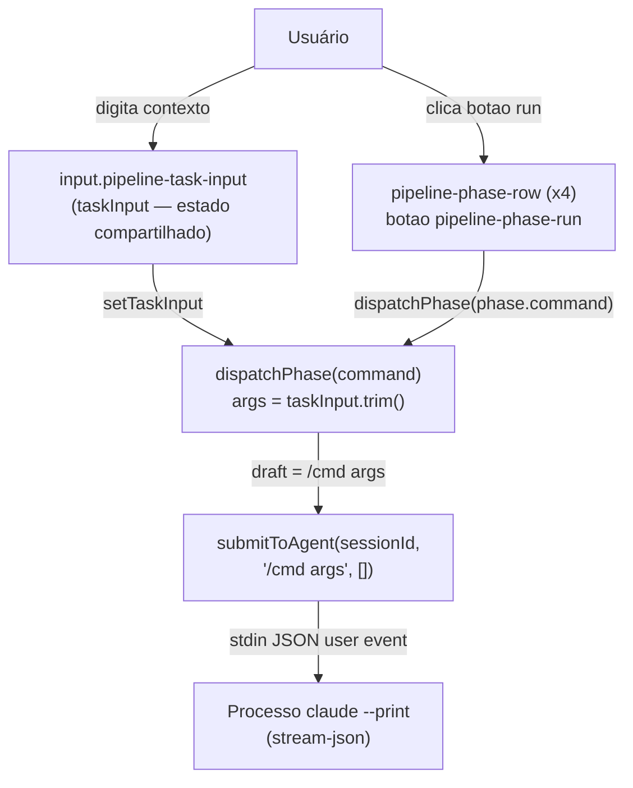
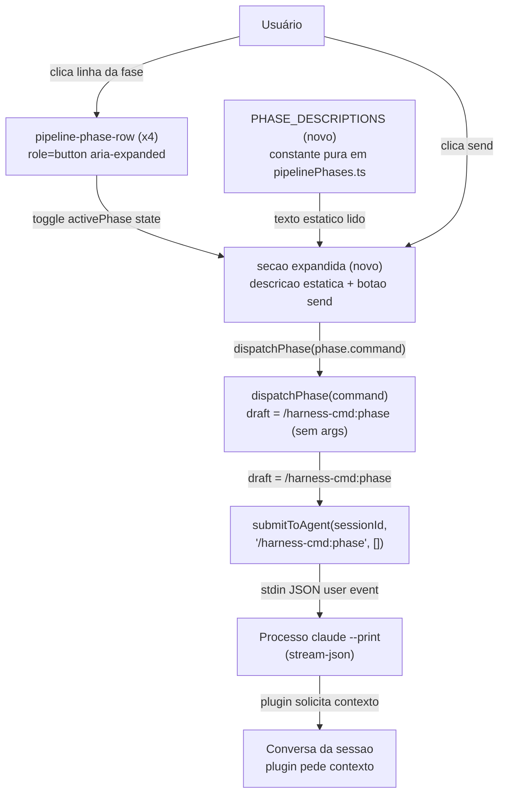

# SPEC: pipeline-phase-inline-input

## Metadata
- Jira: N/A (developer-confirmed scope revision)
- Service: entry-ide — PipelinePanel (Workbench tab, SDD workflow)
- Tier: standard
- Version: 2.0
- Architecture references: CLAUDE.md, docs/adr/001-agent-mode.md
- [WARNING] No AGENTS.md or docs/agents/ tree found in the repo. Architecture guidance derived exclusively from CLAUDE.md (state in SessionContext or local component state via useState; functional React components + hooks; CSS per-component in src/styles/components/; strict TypeScript) and ADR 001 (submitToAgent is the single execution path for agent input; the panel is a shortcut, not a second execution path).

---

## Context

The Pipeline panel (Workbench tab) exposes the four SDD phases — spike, plan, task, pr — as a list. In v1.x the panel contained a shared top-level text input (`taskInput` / `.pipeline-task-input`) that was prepended to every phase command, and each phase row had a standalone ▶ button that dispatched the command with that shared text.

The developer rejected that design. v2.0 replaces it with a fundamentally different model:

1. The shared top-level text input is removed entirely. No text entry exists anywhere in the panel at rest.
2. Clicking a phase row toggles an expandable section. The expanded section is read-only except for a single send button: it shows a static per-command description (what the command does and what context it expects) so the user knows what to provide in chat after dispatching.
3. The send button dispatches the bare command `/harness-cmd:<phase>` (no args). The plugin itself asks for context interactively in chat when input is missing — this is existing plugin behavior. No text field lives inside the expanded section.
4. The per-row ▶ run button is eliminated. The send inside the expanded section is the sole dispatch affordance per phase, preventing duplicate dispatch paths.
5. Static descriptions for each phase live alongside `PHASE_COMMANDS` in `src/utils/pipelinePhases.ts` as a pure, testable constant — no React, no UI state.

Architecture constraint (from CLAUDE.md + ADR 001): submission always goes through `submitToAgent(session.id, draft, [])`. Components are functional with hooks. CSS lives in `src/styles/components/PipelinePanel.css`. Business logic must not live in the component.

---

## AS IS — Estado atual

O usuário preenche o campo compartilhado no topo do painel, clica o botao ▶ na linha da fase desejada, e `dispatchPhase` monta o draft concatenando comando e texto; a sessão recebe o comando via `submitToAgent`. O campo nao e limpo apos o envio.

---

## TO BE — Estado proposto

Apos a implementacao, clicar uma linha de fase expande uma secao estatica com descricao do comando e um botao send; o campo compartilhado e o botao ▶ por linha sao removidos. O dispatch envia apenas o bare command — o plugin conduz a coleta de contexto em chat. Os nos `NEW_ExpandedSection` e `NEW_PhaseDescriptions` realizam RF-01, RF-02, RF-03, RF-04, RF-05, UI-01, UI-02 e UI-03.

---

## Scope
- **In**: remocao de `<input className="pipeline-task-input">` e estado `taskInput`; remocao do botao `.pipeline-phase-run` per-row; adicao de estado `activePhase: PhaseKey | null` local ao `PipelinePanel`; renderizacao condicional de uma secao expandida com descricao estatica e botao send por fase ativa; adicao de `PHASE_DESCRIPTIONS: Record<PhaseKey, string>` em `src/utils/pipelinePhases.ts`; envio via `submitToAgent` com draft `/<command>` (sem args).
- **Out**: qualquer campo de texto digitavel no painel; persistencia de estado de expansao entre sessoes ou reloads; multiplas fases expandidas simultaneamente; alteracoes no formato do draft para adicionar args automaticamente; alteracoes no comportamento do plugin harness-cmd; modificacoes em `usePipelineState`.

---

## RIGID (Non-Negotiable)

### Functional Requirements

- **RF-01** [State-Driven] Quando nenhuma fase esta ativa (`activePhase === null`), o painel nao exibe nenhuma secao expandida e nenhum campo de texto de fase.
  - AC: dado o painel renderizado com `activePhase === null`, `container.querySelectorAll('.pipeline-phase-expanded')` retorna lista vazia e `container.querySelectorAll('input[type="text"]')` dentro do painel retorna lista vazia.

- **RF-02** [Event-Driven] Quando o usuario clica em uma `pipeline-phase-row`, o sistema define `activePhase` para a chave daquela fase e renderiza a secao expandida correspondente — e fecha qualquer secao expandida de outra fase previamente aberta.
  - AC (abertura): dado `activePhase === null`, clicar a row da fase `plan` define `activePhase === 'plan'` e torna o elemento `.pipeline-phase-expanded` da fase `plan` presente no DOM.
  - AC (troca): dado `activePhase === 'plan'`, clicar a row da fase `spike` define `activePhase === 'spike'`; o `.pipeline-phase-expanded` de `plan` deixa de existir no DOM; o de `spike` esta presente.
  - AC (toggle fechar): dado `activePhase === 'plan'`, clicar novamente a row da fase `plan` define `activePhase === null` e remove o `.pipeline-phase-expanded` de `plan` do DOM.

- **RF-03** [Event-Driven] Quando o usuario clica no botao send dentro da secao expandida de uma fase com `isStreaming === false`, o sistema chama `submitToAgent(session.id, draft, [])` onde `draft` e exatamente `/<command>` — sem argumentos e sem espaco trailing — sendo `command` o valor de `PHASE_COMMANDS[phase.key]` (verified at `src/utils/pipelinePhases.ts:37-42`).
  - AC (spike): dado `activePhase === 'spike'`, clicar send chama `submitToAgent` com segundo argumento `"/harness-cmd:spike"` exatamente.
  - AC (plan): dado `activePhase === 'plan'`, clicar send chama `submitToAgent` com segundo argumento `"/harness-cmd:plan"` exatamente.
  - AC (task): dado `activePhase === 'task'`, clicar send chama `submitToAgent` com segundo argumento `"/harness-cmd:task"` exatamente.
  - AC (pr): dado `activePhase === 'pr'`, clicar send chama `submitToAgent` com segundo argumento `"/harness-cmd:pr"` exatamente.

- **RF-04** [Conditional] Quando `isStreaming === true`, o botao send de qualquer secao expandida esta desabilitado e o clique na `pipeline-phase-row` nao altera `activePhase`.
  - AC (send desabilitado): dado `isStreaming === true` e `activePhase` nao-nulo, o botao send tem atributo `disabled`; `submitToAgent` nao e chamado ao clicar o botao.
  - AC (row inerte): dado `isStreaming === true`, clicar qualquer `pipeline-phase-row` nao altera `activePhase`; nenhuma nova secao expandida aparece no DOM.

- **RF-05** [State-Driven] O elemento `<input className="pipeline-task-input">`, o estado `taskInput` e o botao `.pipeline-phase-run` sao removidos do componente `PipelinePanel`. Nenhum campo compartilhado de texto e nenhum botao de dispatch fora da secao expandida existem no DOM durante renderizacao normal do painel.
  - AC (task-input ausente): `container.querySelector('.pipeline-task-input')` retorna `null`.
  - AC (phase-run ausente): `container.querySelectorAll('.pipeline-phase-run')` retorna lista vazia.
  - AC (sem dispatch fora da expansao): `submitToAgent` nao e chamado por nenhum elemento fora de `.pipeline-phase-expanded`.

- **RF-06** [State-Driven] `PHASE_DESCRIPTIONS` e um objeto puro `Record<PhaseKey, string>` exportado de `src/utils/pipelinePhases.ts`, co-localizado com `PHASE_COMMANDS`. Cada entrada descreve o que a fase faz e que contexto o plugin pedira em chat. Valores de referencia (nao-RIGID quanto ao texto exato, RIGID quanto a existencia e exportacao):
  - `spike`: descricao indica investigacao/discovery e menciona chave Jira ou tema como contexto esperado.
  - `plan`: descricao indica geracao de SPEC.md e PLAN.md e menciona CRED-XXX ou descricao de task como contexto.
  - `task`: descricao indica implementacao do PLAN.
  - `pr`: descricao indica abertura de pull request.
  - AC: `import { PHASE_DESCRIPTIONS } from '../utils/pipelinePhases'` resolve sem erro; `Object.keys(PHASE_DESCRIPTIONS)` e igual a `['spike', 'plan', 'task', 'pr']`; cada valor e string nao-vazia.

### UI Requirements

- **UI-01** [Event-Driven] O elemento `.pipeline-phase-row` e o gatilho de expansao. Ele deve ter `role="button"`, `tabIndex={0}`, e `aria-expanded` booleano refletindo o estado (`true` quando a fase esta ativa, `false` caso contrario). Quando `isStreaming === true`, o elemento tem `aria-disabled="true"`. O teclado deve acionar o toggle via `Enter` e `Space` (handlers `onKeyDown`).
  - AC (aria-expanded): dado `activePhase === 'spike'`, o `.pipeline-phase-row` da fase `spike` tem `aria-expanded="true"`; os demais tem `aria-expanded="false"`.
  - AC (aria-disabled): dado `isStreaming === true`, todos os `.pipeline-phase-row` tem `aria-disabled="true"`.
  - AC (teclado): pressionar `Enter` no `.pipeline-phase-row` de uma fase produz o mesmo efeito que clicar — `activePhase` muda conforme esperado; passa se o spy de `activePhase` registrar a mudanca apos `fireEvent.keyDown(..., { key: 'Enter' })`.

- **UI-02** [State-Driven] A secao expandida e renderizada imediatamente apos a `pipeline-phase-row` da fase ativa, dentro do `<li>` daquela fase, antes de quaisquer `pipeline-phase-detail` e `pipeline-phase-artifacts`.
  - AC: dado o campo expandido aberto para uma fase com `detail` e `artifacts`, a ordem DOM dentro do `<li>` e: `.pipeline-phase-row` → `.pipeline-phase-expanded` → `.pipeline-phase-detail` (se presente) → `.pipeline-phase-artifacts` (se presente); passa se `li.children[1]` tem classe `pipeline-phase-expanded`.

- **UI-03** [State-Driven] A secao expandida exibe o texto de `PHASE_DESCRIPTIONS[phase.key]` como conteudo estatico legivel, e um unico botao send. Nao ha campo de texto editavel dentro da secao expandida.
  - AC (descricao presente): dado `activePhase === 'spike'`, o texto de `PHASE_DESCRIPTIONS.spike` esta visivel no DOM dentro de `.pipeline-phase-expanded`; passa se `getByText(PHASE_DESCRIPTIONS.spike)` nao lanca.
  - AC (sem input): `container.querySelector('.pipeline-phase-expanded input')` retorna `null`.
  - AC (botao send presente): dentro de `.pipeline-phase-expanded`, existe exatamente um `<button>` com texto ou aria-label comunicando envio; `getByRole('button', { name: /enviar|send/i })` retorna exatamente um elemento enquanto a secao esta aberta.

### Non-Functional Requirements

- **RNF-01**: A secao expandida deve estar disponivel para interacao (botao send clicavel) em menos de 100 ms apos o clique na row, sem animacoes de transicao CSS que adiem `pointer-events`.
  - AC: em testes de renderizacao sincronos (vitest + jsdom), o botao send esta no DOM imediatamente apos `fireEvent.click` na row; em producao, nenhum `transition` CSS bloqueia `pointer-events` antes de 100 ms.

- **RNF-02**: Todo CSS da secao expandida e do botao send deve residir exclusivamente em `src/styles/components/PipelinePanel.css`, usando tokens CSS do tema (`var(--bg-1)`, `var(--accent)`, `var(--rule)`, `var(--text-1)`, `var(--text-2)`, `var(--font-mono)`) — sem CSS inline nem CSS-in-JS.
  - AC: `src/styles/components/PipelinePanel.css` contem seletores para `.pipeline-phase-expanded` e para o botao send; `grep -n 'style={{' src/components/PipelinePanel.tsx` retorna zero ocorrencias novas.

---

## FLEXIBLE (Implementation Suggestions)

Estas sugestoes sao internas e nao fazem parte do contrato verificavel.

- **Estado local**: `activePhase: PhaseKey | null` mantido com `useState` local em `PipelinePanel` — sem necessidade de elevar ao `SessionContext`, pois e estado de UI efemero.

- **Texto das descricoes**: sugestao de valores para `PHASE_DESCRIPTIONS` (nao-RIGID quanto ao texto exato):
  - `spike`: `"investigacao/discovery — o plugin pedira chave Jira ou tema ao iniciar"`
  - `plan`: `"gera SPEC.md + PLAN.md — o plugin pedira CRED-XXX ou descricao da task"`
  - `task`: `"implementa o PLAN existente no worktree"`
  - `pr`: `"abre pull request para o branch atual"`

- **Subcomponente**: a secao expandida pode ser extraida para uma funcao local `PhaseExpandedSection` dentro do mesmo arquivo `PipelinePanel.tsx` — sem criar novo arquivo. Recebe `phase`, `onSend`, `disabled` como props.

- **Fechar ao pressionar Escape**: `onKeyDown` no `.pipeline-phase-expanded` pode fechar a secao via `setActivePhase(null)` ao receber `Escape`. Nao e RIGID pois nao foi solicitado, mas e convencional e de baixo custo.

- **CSS sugerido**: `.pipeline-phase-expanded` para o container da secao, `.pipeline-phase-description` para o texto estatico, `.pipeline-phase-send` para o botao. Usar `display: flex; flex-direction: column; gap: 6px; padding: 6px 0 4px 22px` alinhado ao estilo existente do painel.

- **Delegacao (ADR 001)**: o componente nao contem logica de negocio — `dispatchPhase` monta o draft (`/${command}`) e chama `submitToAgent`; o componente apenas captura o evento de UI e repassa. Manter essa separacao.

- **Um expanded at a time**: implementar com um unico `activePhase` state e substituicao ao clicar outra row (nao acordeao com multiplos abertos). Custo zero, comportamento previsivel.

---

## Acceptance Criteria Summary

| ID     | Criterio                                                                                                   | Testavel? |
|--------|------------------------------------------------------------------------------------------------------------|-----------|
| RF-01  | Nenhuma secao expandida e nenhum input de texto quando `activePhase === null`                              | Sim       |
| RF-02  | Clicar row abre secao da fase; troca fecha anterior; toggle fecha atual                                    | Sim       |
| RF-03  | Send chama `submitToAgent` com `/harness-cmd:<phase>` exato, sem args                                     | Sim       |
| RF-04  | `isStreaming === true` desabilita send e torna row inerte                                                   | Sim       |
| RF-05  | `.pipeline-task-input`, `taskInput` e `.pipeline-phase-run` ausentes do DOM e do componente               | Sim       |
| RF-06  | `PHASE_DESCRIPTIONS` exportado de pipelinePhases.ts; todas as 4 chaves presentes; valores nao-vazios      | Sim       |
| UI-01  | `.pipeline-phase-row` tem `role="button"`, `aria-expanded`, `tabIndex=0`; teclado aciona toggle           | Sim       |
| UI-02  | `.pipeline-phase-expanded` e segundo filho do `<li>`, apos row e antes de detail/artifacts                | Sim       |
| UI-03  | Descricao estatica visivel; sem `<input>` dentro da expansao; exatamente um botao send presente           | Sim       |
| RNF-01 | Botao send disponivel em menos de 100 ms apos clique na row; sem transition bloqueante                    | Sim (unit)|
| RNF-02 | CSS exclusivamente em PipelinePanel.css; zero `style={{` novos no componente                              | Sim (grep)|

---

## Distribution by Repo

Feature 100% contida no repositorio `entry-ide`. Nenhuma dependencia externa ou contrato multi-repo.

| Repo      | RFs afetados                          | Contratos novos |
|-----------|---------------------------------------|-----------------|
| entry-ide | RF-01 a RF-06, UI-01 a UI-03, RNF-01, RNF-02 | Nenhum  |

Arquivos que mudarao:
- `src/utils/pipelinePhases.ts` — adicao de `PHASE_DESCRIPTIONS: Record<PhaseKey, string>` exportado, co-localizado com `PHASE_COMMANDS`.
- `src/components/PipelinePanel.tsx` — remocao de `taskInput`/`pipeline-task-input`/`.pipeline-phase-run`; adicao de `activePhase` state e renderizacao condicional da secao expandida.
- `src/styles/components/PipelinePanel.css` — remocao de `.pipeline-task-input`; adicao de seletores para `.pipeline-phase-expanded`, descricao estatica e botao send.
- `src/__tests__/pipeline-phases.test.ts` — adicao de casos cobrindo `PHASE_DESCRIPTIONS` (RF-06).
- `src/__tests__/` — novo arquivo `pipeline-panel-expand.test.tsx` cobrindo RF-01 a RF-05 e UI-01 a UI-03 via `@testing-library/react` + vitest, seguindo o padrao de `src/__tests__/mcp-panel.test.tsx`.
